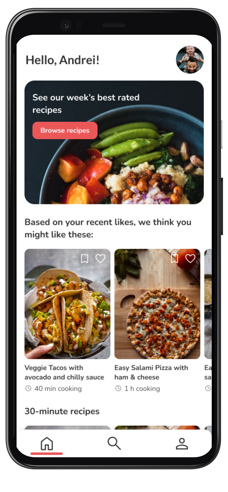
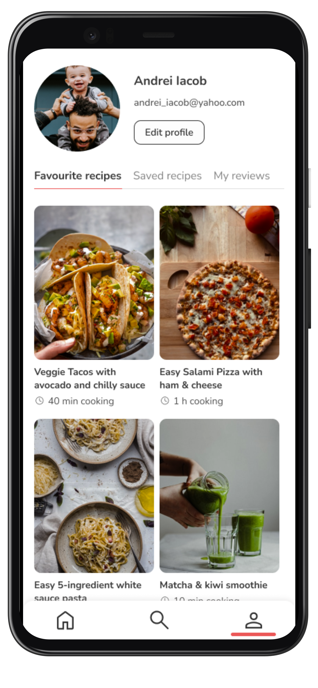

# Smart Bites 🥧
## The mobile application with automated recommendation systems in the food spectrum

## Table of Contents
* [Introduction](#introduction)
* [Tour of the app](#tour-of-the-app)
* [Conclusion](#conclusion)

## Introduction
The solution presented is a user-oriented mobile application that has a system of recommendation for recipes. The system is constructed with artificial intelligence, in order to help the users choose more easily what to eat by automatically recommending various recipes depending on what they thought to be a good fit for them.
The concept of the system is of an easy to use mobile application focused on the user. This means that there are solid concepts and heuristics regarding the user interface and user experience for the purpose of making the navigation and understanding of the app as smooth as possible. Moreover, the recommendations given by the system are tailored to each user that utilises the app, making each relation between the user and the application unique.

## Tour of the app

### Login & Register
<table style="margin-left:auto;margin-right:auto;width:98%">
  <tr>
   <td>  </td>
   <td>  </td>
   <td>  </td>
   <td>  </td>
 </tr> 
</table>

In order for the user to utilise the application, first step is to enter a set of valid credentials. The users log with the already created account or they sign up for a new one and then they can log in. From the backend potint of view, this proccess is possible with the help of the Firebase library.

-----

### Home page

<table style="margin-left:auto;margin-right:auto;width:98%;">
  <tr>
   <td align="center"> 
      
      
   </td>
 </tr> 
</table>

Home page is where the collections of recipes, including the personalised one, can be viewed and inspected. At the top of the screen there is a banner that displays the most appreciated recipe of the week, followed by a collection of recipe recommendations tailered for each user, and than, other recipe collections that may be of help. 

-----

### Recipe page

<table style="margin-left:auto;margin-right:auto;width:98%;">
  <tr>
   <td align="center"> 
      
      
   </td>
 </tr> 
</table>

Recipe page is where the user can check all the details of a specific recipe and follow them in the process of cooking it. Each recipe comes with a name, a rating system, a list of nutritional values, a description, ingredients and steps of how to make it. 

-----

### Account page

<table style="margin-left:auto;margin-right:auto;width:98%;">
  <tr>
   <td align="center"> 
     
   </td>
 </tr> 
</table>

Account page is where users can view their saved and liked recipes, as well see their given ratings and modify their profile.

-----

### Search page

<table style="margin-left:auto;margin-right:auto;width:98%;">
  <tr">
   <td align="center"> 
     
   </td>
 </tr> 
</table>

Search page is where the user can search after a certain recipe by name or category. 
 
 
## Conclusion  

The initial point from which this thesis started was the need for a modern recommendation system based on artificial intelligence, preferably in the form of a mobile application given the fact that during the day, the phone is the main device with which people interact.

There is still some room for improvement that can be developed in the future. First of all, the algorithm of the recommendation systems can be improved regarding its efficiency and performance, by using other recommendation techniques that are more revolutionary. Moreover, the number of functionalities present in this first version of the application is quite small, so as time goes on, other features can be created on top of existing ones to make the user experience even more satisfying. 

All things considered, it is safe to say that Smart Bites is a first-version successful mobile application that succeeds in its quest to resolve the daily problems that come with food recipe searching and nutrition preferences.
